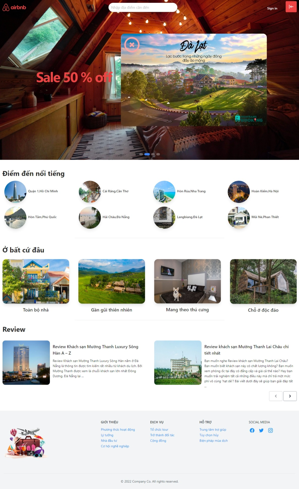

# AirBnb project

Welcome to the AirBnb website. This is a project programmed by Phong.
Thank for watching !

<!-- <div align="center">
  <a href="https://airbnb-sigma-three.vercel.app/">
    
  </a>
  <p align="center">
    <a href="https://airbnb-sigma-three.vercel.app/">View Demo</a>
  </p>
</div> -->

<br />

<div align="center">
  
  <a href="./src/assets/HomePage.jpeg">HomePage</a>
  <a href="./src/assets/DetailPage.jpeg">DetailPage</a>
  <a href="./src/assets/RoomPage.jpeg">RoomPage</a>
  <a href="./src/assets/UserPage.jpeg">PersonalPage</a>
</div>

## Install

In the project directory, you can run:

```sh
npm i
npm start
```

Open [http://localhost:3000](http://localhost:3000) to view it in your browser.

## Requests

-   Create an account or you can use
    Account :
    vanphong1993@gmail.com/123456
-   You can't book room if you are not logged in.

### Third Party libraries used except for React and Tailwind

-   [react-rounter-dom](https://reactrouter.com/en/main)
-   [axios](https://github.com/axios/axios)
-   [antd](https://ant.design/)
-   [react-redux](https://react-redux.js.org/)
-   [redux-toolkit](https://redux-toolkit.js.org/)

### Todo

-   Use database from to CyberSoft center.
-   UserPage is written by me and Tam wrote AdminPage.
-   Use Redux Thunk as a middleware for data processing then render on the website with ReacHook.
-   Use Tailwind as a primary tool for design UI/UX.

## Description

### UserPage

-   Find room information, quick view.
-   Book room.
-   View history and edit user information.
